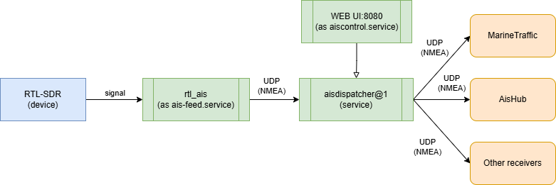

# Ansible Role for AIS Components Installation on Raspberry Pi

Set up and run an AIS receiver system using RTL-SDR hardware on Raspberry Pi 4.
This repo provides an installation guide on how to set up an AIS station for MarineTraffic or AIS Hub as easily as a FlightRadar feeder.

## How to up and run?

Create a playbook like in `site.yml`, add your rpi host info to `inventory` fill role parameters based on your needs,
definitive documentation about parameters usage can be found by the [link](https://github.com/dyadyaJora/ansible-rpi-ais-on-rtl-sdr/tree/master/ais-receiver)

Run playbook using command:

    ansible-playbook -i inventory.yml site.yml

## Prerequisites

* Raspberry Pi or compatible Linux system (ARM-based)
* RTL-SDR USB dongle
* Antenna suitable for marine VHF frequencies
* SSH access to the target machine
* For best results, your location should be near active shipping routes.

